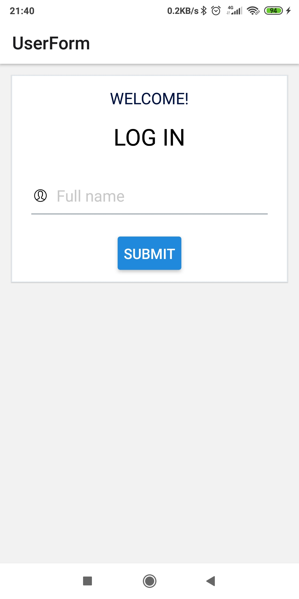
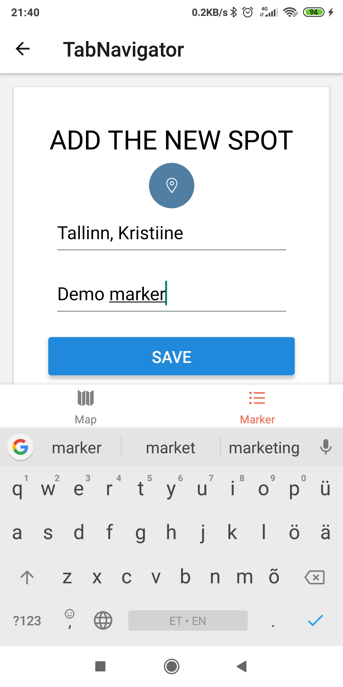
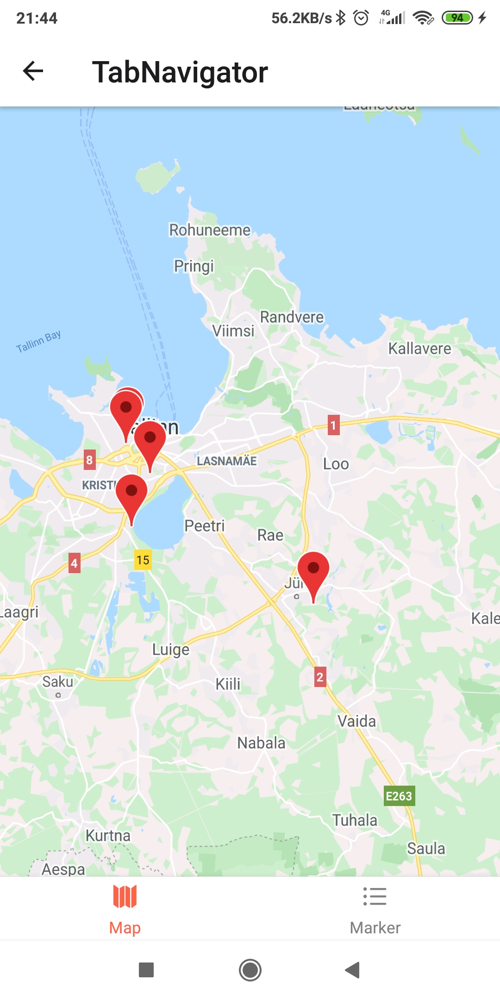
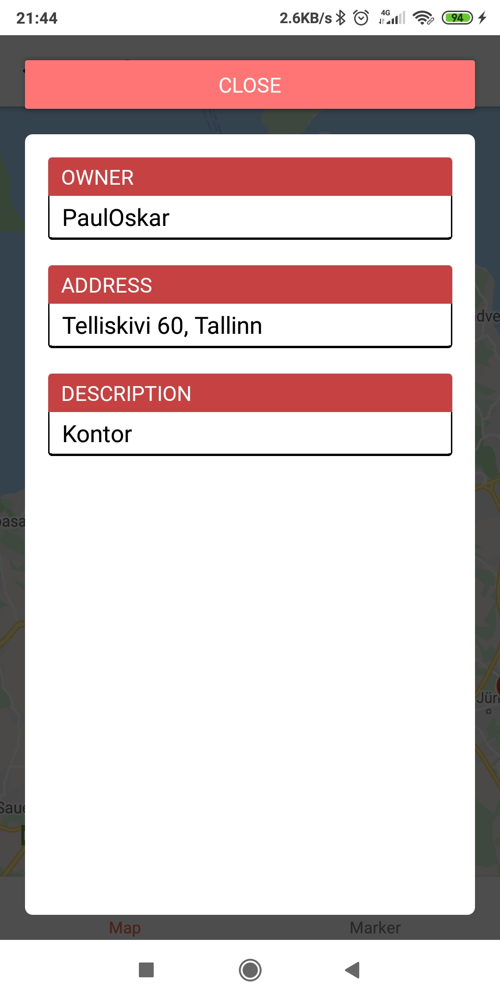
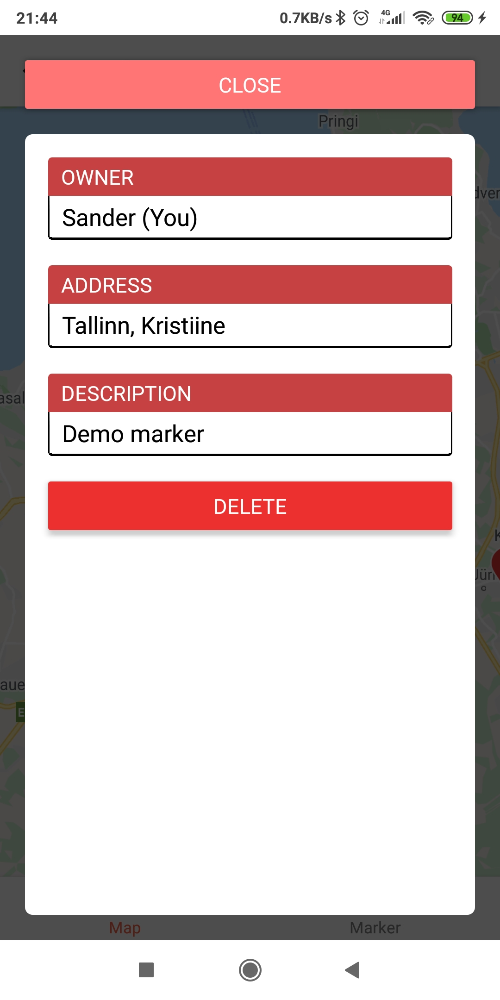

# SightMap
## Grupi liikmed
* **Sander Hanni**
* **Paul Oskar Soe**
* **Simone Niinemägi**
* **Kristo Roots**
* *Petrik Sarri*


## Installatsioon

Installi expo client

``` npm install expo-cli --global```

Mine põhikausta 

```cd SightMap```
    
Installi node modules

```npm install```

Jooksuta projekti

```
npm run start
npm run server
```

## Kirjeldus
Sightmap on kaardipõhine rakendus, kus kasutajatel on võimalik ise luua markereid, mida kaardile paigutatakse. Rakenduse eesmärk on luua kasutajatele platvorm, kus neil on võimalik jagada asukohta kaardil teiste kasutajatega.
 
 Kuigi esialgses rakenduses ei ole otseseid kategooriad veel määratud, on tulevikus plaanis luua erinevaid kategooriad, kus kasutajad saavad asukohti teistega jagada.
  
 Näiteks võiks tuua eriliste taimeliikide kategooria, kus kasutajad  saavad jagada eriliste teimede asukohti teistega, kes taimedest huvitatud on. Selle abil on teistel kasutajatel võimalus neid taimi ka päriselus vaatama minna.
 
 ## Tarkvara nõuded
 
* React native 5.1.6
* Expo 37.3.0
* Android SDK 16+ (Android 4.1 või uuem, iOS 10.0 või uuem)

## Pildid
 
 
 
 
 
 


